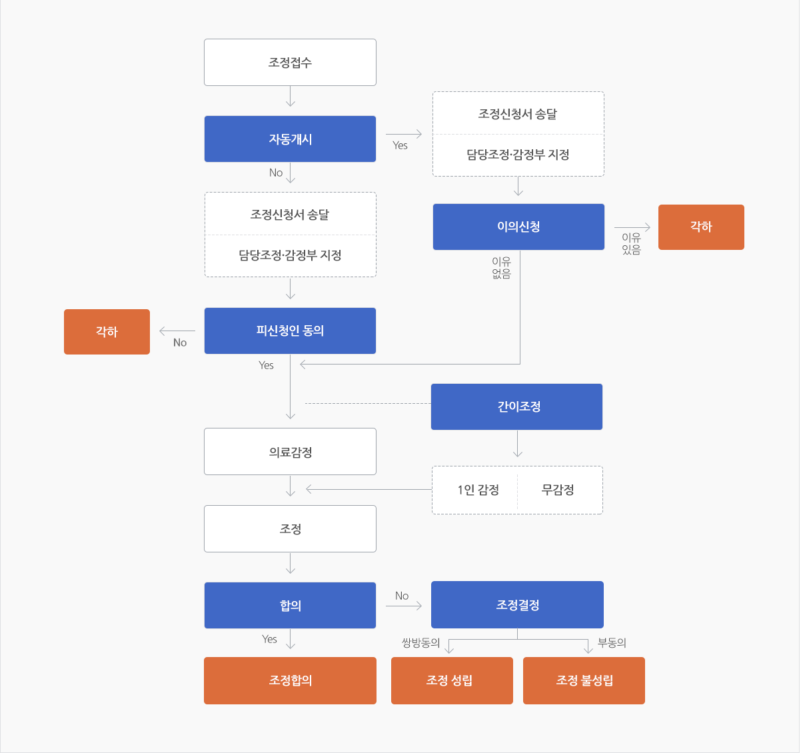
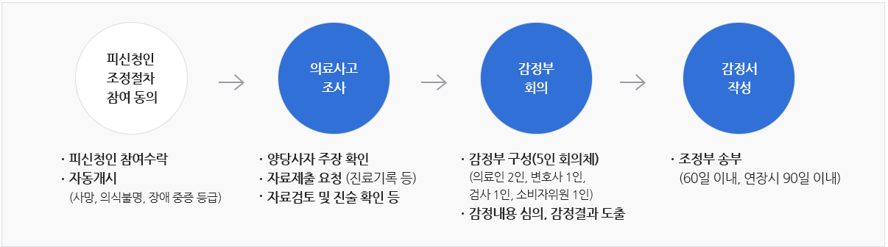
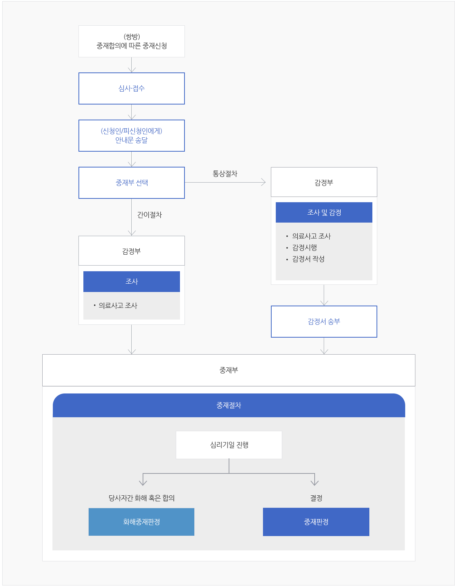
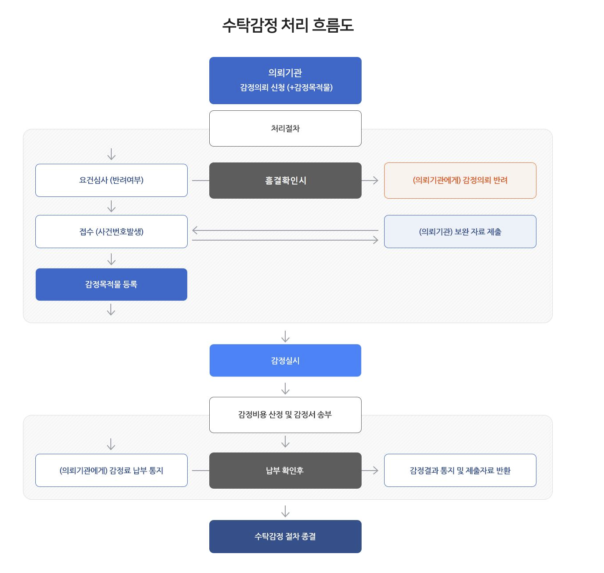
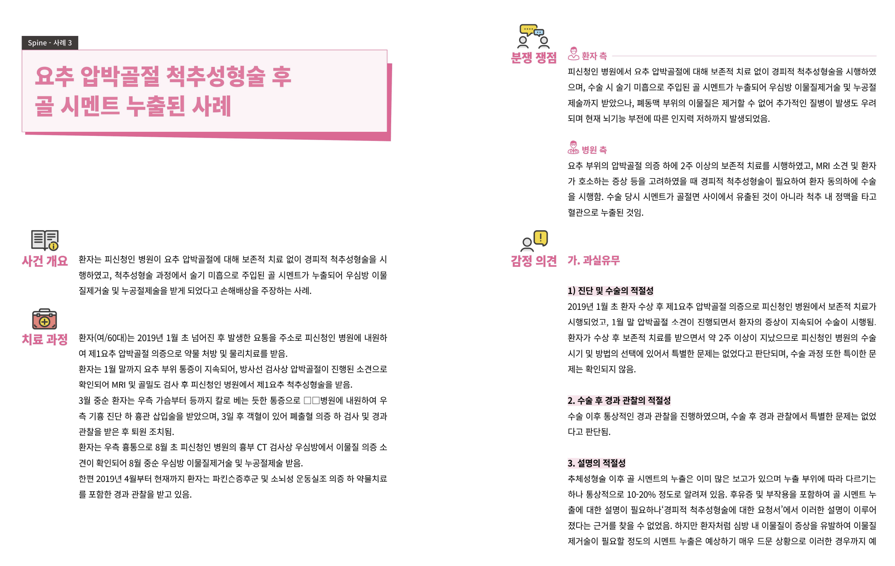
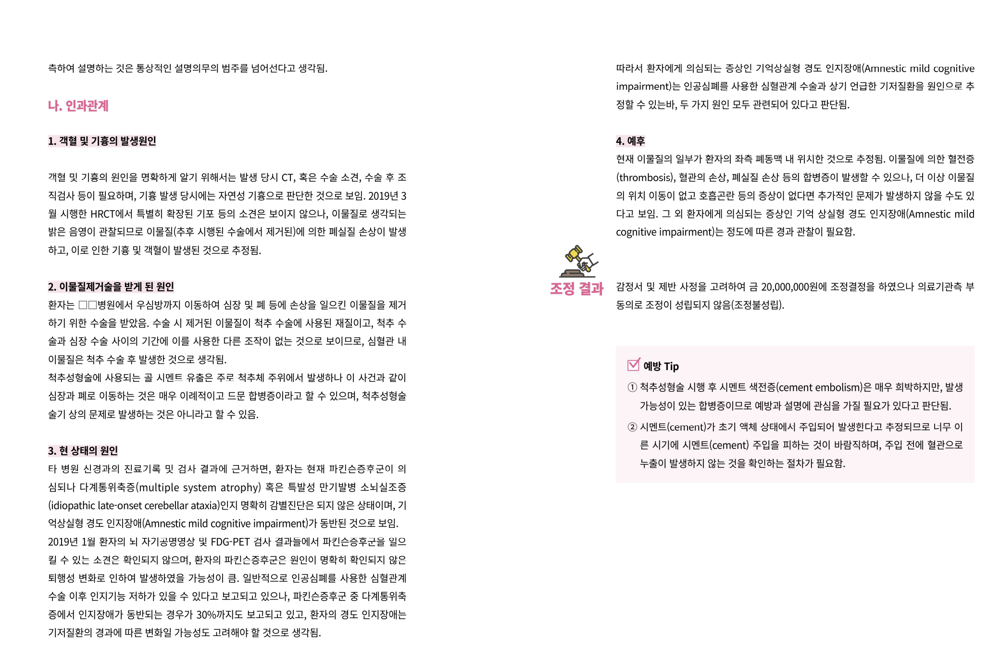

## Introduction

의료행위는 환자의 생명과 건강을 직접적으로 다루는 특성상, 예상하지 못한 결과나 사고가 환자에게 직접적인 피해를 가할 수 있다. 그로 인해 환자와 의료인 사이의 분쟁으로 이어질 수 있다. 그러나 분쟁이 법적 소송으로 이어질 경우 갈등이 장기화되고, 경제적, 시간적으로도 양측에 부담이 될 수 있다. 그래서 의료사고 분쟁을 소송까지 가기 전에 해결하도록 돕는 기관이 한국의료분쟁조정중재원이다.

의료분쟁조정중재원은 조정, 중재, 감정 등으로 의료적 과실을 판단한 후 신청인과 피신청인의 합의나 판정을 도와주는 공공기관이다.

이 글에서는 의료분쟁조정중재원이 정확히 어떤 일들을 하는지, 그리고 각 업무에 따른 자세한 순서와 정보에 대해 정리한다.

# 의료분쟁 조정/중재란?

한국의료분쟁조정중재원에는 2가지 주요 분쟁 해결 절차가 존재하는데, 조정과 중재이다.

## **1. 조정 절차**

조정 절차란 신청인이 한국의료분쟁조정중재원에 조정 신청을 하여 절차가 시작되면, 우선적으로 감정부에서 당사자들의 주장과 사실 여부를 판단한 후, 의료적 과실과 인과관계의 유무 등 정보를 총합하여 조정부에 넘긴 뒤, 조정부에서 관련 정보를 종합적으로 판단하여 적절한 합의안을 만들어 양측에 제공하고 동의를 얻음으로써 분쟁의 원만한 해결에 이를 수 있도록 돕는 절차이다.

**조정의 핵심은 합의/동의이다.**

조정부가 조정결정을 내리더라도 양측 모두의 동의를 받고 이의가 없어야 조정성립이 만들어질 수 있다. 그렇지 않으면 조정불성립으로 이어지며, 법원 소송으로 이어질 수도 있다.

## **2. 중재 절차**

중재 절차란 당사자들 간에 한국의료분쟁조정중재원의 최종 결정에 따르기로 합의한 후 중재 신청을 통해 분쟁 해결을 돕는 절차이다.

**중재의 핵심은 최종 결정이다.**

중재 절차에서는 중재부가 내린 결정을 신청인과 피신청인 모두가 절대적으로 따라야 하며, 조정이 합의를 유도하는 것에 가깝다면, 중재는 판정을 통한 분쟁 해결에 가깝다.

## 조정/중재 절차 흐름

조정과 중재는 비슷하면서도 다른 절차 흐름을 가지고 있다. 각각의 절차가 어떻게 되며, 그 차이점까지 정리한다.

### **조정 절차 흐름:**

**조정 절차는 대략 다음과 같이 이해할 수 있다.**

- 조정신청
- 접수 및 요건 확인
- 피신청인에게 신청서 송달
- 피신청인 참여 동의 확인
- 조정절차 개시
- 의료사고 조사 및 감정
- 조정부의 조정 진행
- 합의 제시 또는 조정결정
- 신청인, 피신청인에게 통보
- 조정성립 또는 조정 불성립

### **조정신청**

조정신청은 환자 또는 보건의료기관이 의료분쟁 해결을 위해 의료중재원에 절차 개시를 요청하는 단계이다. 신청인은 조정을 신청한 사람, 피신청인은 조정 신청을 당한 사람이다.

일반적으로는 환자가 병원을 상대로 조정을 신청해 환자가 신청인, 병원 측이 피신청인이 되는 경우가 상당수지만, 간혹 병원/의료인 측에서 환자를 상대로 조정 신청을 하는 경우도 있다.

### **접수 및 요건 확인**

신청서가 들어왔을 때, 의료중재원에서 이 사건이 조정 또는 중재 절차로 이어질 수 있는지를 판단하는 단계이다.

**확인하는 주요 요건들은:**

- 신청서가 제대로 작성됐는지 확인
- 필요한 서류(진료기록, 신분증, 위임장, 개인정보 동의서 등)가 전부 있는지 확인
- 의료중재원이 다룰 수 있는 사건인지 확인
- 이미 다른 절차가 진행 중인지 확인 - 같은 사건으로 이미 법원 소송이나 조정/중재 절차가 진행 중이면 문제가 될 수 있음.
- 신청인이 맞는 사람인지(본인인지, 대리인인지 등)

### **피신청인 참여 동의 확인**

일반적인 조정 사건에서는 피신청인의 참여 동의 없이는 조정 절차를 진행할 수 없다.

피신청인이 참여하지 않으면 절차는 각하 또는 절차 미개시로 이어진다.

하지만 예외가 존재하니 자동개시가 진행될 수 있는 케이스가 있다.

일부 중대한 의료사고의 경우에는 피신청인의 동의가 없어도 조정절차가 자동으로 개시될 수 있으며, 중대한 사고로는 사망, 일정 기간 이상의 의식불명, 중증장애 등이 포함된다.

### **의료사고 조사 및 감정**

조정절차가 개시되면 의료중재원의 감정부가 의료사고에 대한 조사와 감정을 진행할 수 있다.

**조사와 감정 과정에서 주로 보는 것은 다음과 같다:**

- 의료행위 과정에서 과실이 있었는지
- 의료행위와 환자 피해 사이에 인과관계가 있는지
- 당시 진료, 수술, 처치, 설명, 경과관찰이 적절했는지
- 손해배상 판단에 참고할 의학적 근거가 있는지

### **조정 진행 및 결과**

**조사 및 감정 결과가 나오면 당사자 주장과 취합하여 조정부가 조정을 진행한다. 조정 절차 중 나올 수 있는 결과는 다음과 같다:**

**조정합의:** 조정 절차가 진행되는 중 신청인과 피신청인이 서로 합의하여 분쟁을 해결하는 것이다.

**조정결정:** 조정부가 적절한 해결안을 결정하여 당사자들에게 제시하는 것이다.

**조정 성립:** 조정 합의가 이루어졌거나 조정 결정에 양측이 동의하여 조정 분쟁이 성공적으로 끝난 것이다.

**조정불성립:** 조정 절차가 진행되어 조정결정까지 마무리되었지만 당사자들 중 한쪽 또는 양쪽이 합의 또는 조정결정에 동의하지 않아 분쟁이 해결되지 않은 것이다.

**부조정결정:** 조정부에서 사건의 성격상 조정을 하지 않는 것이 적절하다고 판단하여 조정을 하지 않는 것이다.

**취하:** 신청인이 본인이 낸 조정신청을 스스로 거두는 것이다.

**각하:** 절차 요건이 맞지 않아 사건 내용을 본격적으로 판단하기 전에 종료하는 것이다.

### **중재 절차 흐름:**

**중재 절차는 대략 다음과 같이 이해할 수 있다.**

- 중재합의
- 중재신청
- 접수 및 요건 확인
- 중재부 선택 또는 지정
- 조사 및 감정(간이절차, 통상절차)
- 중재부 심리
- 화해중재판정 또는 중재판정
- 당사자에게 통보

### **중재합의**

중재합의는 신청인과 피신청인이 "이 사건은 의료중재원의 판정에 전적으로 따르겠다”라고 합의하는 단계이다.

조정과 달리 중재는 결과가 나올 시 결과에 무조건적으로 따라야 한다.

### **간이절차와 통상절차**

중재 절차에는 조사 및 감정 단계에서 사건의 깊이에 따라 간이절차와 통상절차가 존재할 수 있다.

간이절차는 비교적 단순한 사건을 빠르게 처리하기 위한 절차이며, 의학적 쟁점이 복잡하지 않거나 자료와 사실관계가 비교적 명확한 사건들에서 활용될 수 있다.

반면 통상절차는 정식적인 감정 절차이며, 감정부가 의료사고를 조사하고 감정을 시행한 뒤, 감정서를 작성하여 중재부가 판단할 수 있게 한다.

### **화해중재판정 또는 중재판정**

화해중재판정이란 중재 절차 도중 양측이 합의하여 그 합의 내용을 토대로 중재판정 형식으로 작성하는 것이다.

중재판정이란 양쪽이 합의하지 못했을 때 중재부가 조사와 감정된 정보들을 토대로 중재판정을 내려주는 것이다.

### **조정절차 Vs. 중재절차**

조정절차에 비해 중재절차는 당사자들이 사건에 대해 중재판정에 따르기로 서면 합의해야 하므로, 절차 선택에 더 신중할 수밖에 없다. 조정은 당사자 간 합의를 유도하는 절차인 반면, 중재는 중재부의 판정을 통해 분쟁을 보다 확정적으로 해결하는 절차이기 때문에 소송까지 가지 않고 전문기관의 판단을 통해 신속하게 분쟁을 마무리하고자 할 때 중재가 활용될 수 있다.

2025년 기준 의료중재원의 공식 자료를 통해서도 조정 처리가 중재 처리보다 압도적으로 많은 것으로 확인할 수 있습니다.

### **감정과 수탁감정의 차이**

일반적인 감정이란 조정·중재 절차 중 이뤄지는 감정이다.

감정부에서 의료사고의 과실 유무 등 전문적, 객관적인 감정을 통해 과학적 판단 근거를 마련한다. 그것을 통해 조정부/중재부에서 판정을 내릴 수 있도록 돕는 절차이다.

반면 수탁감정은 조정/중재 절차 중 이뤄지는 감정이 아닌 법원, 경찰, 검찰 같은 외부 기관이 의료중재원에 감정을 맡기는 것이다.

## 공개 감정사례를 통해 본 사건 기록 구조

의료중재원에서는 실제 의료분쟁 사례를 바탕으로 한 감정사례를 공개하기도 한다. 이렇게 공개된 자료들은 실제 사건을 그대로 보여주는 원자료는 아니지만, 개인정보와 기관 정보를 비식별 처리한 뒤 사고 예방과 교육을 목적으로 일부 공개해 놓은 자료로 이해할 수 있다. 

공개 감정사례를 보면 의료분쟁 사건이 마냥 간단하지 않고, 사건 개요, 치료 과정, 양측 주장, 감정 의견, 조정 결과 등으로 정리되어 있다는 것을 확인할 수 있다.

더 자세한 내용은 [의료중재원 공개 감정사례](https://www.k-medi.or.kr/web/lay1/bbs/S1T27C96/A/25/view.do?article_seq=12822&cpage=1&rows=10&condition=&keyword=)에서 확인할 수 있다. 

## 조정/중재 절차에서 확인되는 주요 기록과 정보

조정/중재 절차에서는 다양한 문서와 기록이 생성되는데, 이것들은 신청서, 별지, 위임장, 참여의사확인서, 답변서, 감정서, 조정결정서, 조정조서 등 다양하다.

따라서 한국의료분쟁조정중재원을 더 깊이 이해하기 위해서는 개념만 아는 것이 아니라, 각 절차에서 어떤 정보가 존재하는지도 이해할 필요가 있다.

### **신청 단계에서 확인되는 정보**

신청 단계에서는 신청인과 피신청인, 환자용 또는 보건의료기관용 신청 여부, 대리인 신청 여부, 조정 신청 내용, 의료사고 경위, 손해배상 청구 내용 등을 확인할 수 있습니다.

이 정보들이 확인되는 문서는: 조정신청서, 조정(중재)신청서 별지, 위임장, 개인정보/민감정보 수집/이용 동의서 등의 서류에서 확인할 수 있습니다.

### **피신청인 참여 및 개시 단계에서 확인되는 정보**

피신청인 참여 및 개시 단계에서는 피신청인 참여 여부, 조정절차 개시 여부, 자동개시 여부, 각하 여부 등의 정보를 확인할 수 있습니다.

이 정보들은 조정신청서, 참여의사확인서, 답변서, 이의신청서 등의 문서/기록에서 확인할 수 있습니다.

해당 문서들은 피신청인이 조정 사건에 참여하였는지, 피신청인이 과실/피해를 인정하는지 부정하는지 등 다양한 정보를 확인할 수 있습니다.

### **감정 단계에서 확인되는 정보**

감정 단계에서는 우선적으로 당사자들이 제출한 자료와 정보를 사용하여 감정하는 단계이다.

당사자들이 제출한 자료와 정보에는 진료 내용, 수술 방법과 과정, 검사 수치, 의료인이 설명의무를 이행했는지 여부 등 다양한 정보가 확인 가능합니다.

위 정보들은 감정을 하기 위해 필요한 문서/기록들인 진료기록부, 수술기록지, 검사결과지, 설명동의서에서 확인할 수 있습니다.

이후, 위 정보들을 이용하여 감정부에서 감정을 완료한 문서들은 감정서, 감정자료 검토 기록, 감정서 송부 기록 등, 의료사고의 사실관계, 과실 여부, 인과관계 판단 등 조정/중재 과정에 도움이 되는 정보들이 취합되어 있습니다.

### **조정 단계에서 확인되는 정보**

조정 단계에서는 조정기일 일시, 출석 여부, 양측 의견, 당사자 간 합의 내용, 조정부가 제시한 결정 내용, 조정을 하지 않았다면 그 사유 등의 정보들을 확인 가능합니다.

위 정보들은 조정 절차에서 발생하는 기록들을 정리해놓은 문서/기록들인 조정기일 기록, 조정조서, 조정결정서, 부조정결정 관련 문서, 조정불성립 기록, 취하서 등에서 확인할 수 있습니다.

### **중재 단계에서 확인되는 정보**

중재 단계에서는 중재판정에 따르기로 합의했는지 여부, 중재 신청 사실과 사건 내용, 중재부 심리 진행 여부, 최종 판정 내용 등의 정보를 확인할 수 있습니다.

이러한 정보들은 중재 절차에서 발생하는 기록들인 중재합의서, 중재신청서, 중재기일 기록, 화해중재판정서, 중재판정서에서 확인할 수 있습니다.

### **수탁감정에서 확인되는 정보**

수탁감정은 일반적인 조정/중재 사건에서 이루어지는 감정과 달리, 법원, 검찰, 경찰, 공공기관 등 외부 기관이 감정을 의뢰하는 제도이기 때문에 확인할 수 있는 정보들이 일반적인 기록과 정보와 다릅니다.

수탁감정에서 확인할 수 있는 정보로는 의뢰기관/감정 의뢰 내용/감정 문항, 외부 기관이 묻는 감정 쟁점, 감정 결과, 의뢰기관에 감정 결과가 전달되었는지 여부, 감정료 등을 확인할 수 있습니다.

위 정보들은 수탁감정 의뢰서, 감정사항 또는 질의서, 수탁감정서, 감정결과 회신 공문, 감정료 산정 관련 문서/기록에서 확인할 수 있습니다.

## Reference

[1] 한국의료분쟁조정중재원, “조정 절차 안내,” 의료분쟁 조정/중재, 제도안내, accessed Jul. 1, 2026.

[2] 한국의료분쟁조정중재원, “중재 절차 안내,” 의료분쟁 조정/중재, 제도안내, accessed Jul. 1, 2026.

[3] 한국의료분쟁조정중재원, “감정 절차 안내,” 의료분쟁 조정/중재, 제도안내, accessed Jul. 1, 2026.

[4] 한국의료분쟁조정중재원, “조정신청 서식,” 의료분쟁 조정/중재, 신청서식, accessed Jul. 1, 2026.

[5] 한국의료분쟁조정중재원, “중재신청 서식,” 의료분쟁 조정/중재, 신청서식, accessed Jul. 1, 2026.

[6] 한국의료분쟁조정중재원, “기타 서식,” 의료분쟁 조정/중재, 신청서식, accessed Jul. 1, 2026.

[7] 한국의료분쟁조정중재원, “수탁감정 제도 소개,” 수탁감정, accessed Jul. 1, 2026.

[8] 한국의료분쟁조정중재원, “수탁감정 의뢰(서식),” 수탁감정, accessed Jul. 1, 2026.

[9] 한국의료분쟁조정중재원, “수탁감정 처리 흐름도,” 수탁감정, accessed Jul. 1, 2026.

[10] 한국의료분쟁조정중재원, “2025년도 의료분쟁 조정·중재 통계연보,” 알림마당, 자료실, 정기간행물, 2026.
